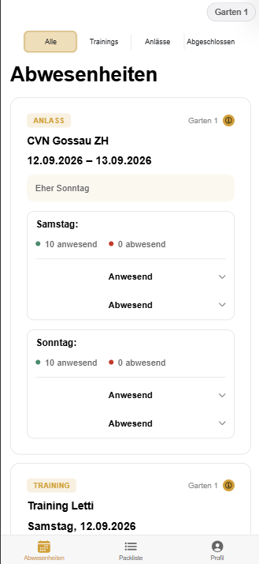

# Voltige Garten App

Eine PWA (Ionic/Angular + Supabase) für die Voltigier-Gruppe **Garten 1** des Vereins Garten: Mitglieder tragen ihre Abwesenheiten für Trainings und Anlässe ein, der Trainer behält den Überblick, und eine gemeinsame Packliste hilft bei der Turniervorbereitung.



## Inhalt

- [Über das Projekt](#über-das-projekt)
- [Funktionen](#funktionen)
- [Rollen](#rollen)
- [Technologien](#technologien)
- [Installation](#installation)
- [Verwendung](#verwendung)
- [Projektstruktur](#projektstruktur)
- [Dokumentation](#dokumentation)
- [Projektstatus](#projektstatus)
- [Autorin](#autorin)

## Über das Projekt

Die App löst ein konkretes Problem der Voltigier-Gruppe Garten 1: Wer kommt zum Training, wer nicht – und warum? Statt WhatsApp-Nachrichten hin und her zu schicken, trägt jede Person ihre An-/Abwesenheit direkt in der App ein. Der Trainer sieht auf einen Blick, wer kommt, und kann Trainings und Anlässe zentral verwalten.

Das Projekt ist bewusst nicht nur für eine einmalige Abgabe gedacht, sondern wird über die ursprüngliche Projektfrist hinaus weiterentwickelt.

## Funktionen

- **Trainings & Anlässe**: einmalig oder als Dauerauftrag mit optionalem Verfalldatum, inkl. Absagen und Löschen einzelner Termine oder ganzer Serien.
- **Abwesenheiten**: An-/Abmelden pro Termin, mit Pflicht-Grund bei Abwesenheit und einer Privat-Einstellung, die den Grund nur für den Trainer sichtbar macht.
- **Packliste**: gemeinsame, gruppenweite Liste für die Turniervorbereitung – alle können abhaken, der Trainer verwaltet die Vorlage und kann sie zurücksetzen.
- **Rollenbasierte Rechte**: Trainer, Volti und Eltern sehen und dürfen unterschiedliche Dinge (siehe unten).
- **Realtime**: Änderungen an Abwesenheiten und Packliste erscheinen sofort auf allen Geräten.
- **Light-/Darkmode** sowie zwei wählbare Farbschemen (Gelb/Rot).
- **Passwort-vergessen-Funktion** und vollständig löschbares Profil.

## Rollen

| Rolle | Rechte |
|---|---|
| **Trainer** | Sieht alles, verwaltet Trainings/Anlässe (inkl. Absagen/Löschen) und die Packliste, sieht immer den echten Abwesenheitsgrund. |
| **Volti** | Trägt eigene An-/Abwesenheit ein, hakt in der Packliste mit ab. |
| **Eltern** | Rein lesend – sehen Abwesenheiten (ohne private Gründe) und die Packliste, ohne Bearbeitungsrechte. |

Die Zuteilung erfolgt über separate Einladungscodes bei der Registrierung (Gruppen-Code für Volti/Eltern, eigener Code für Trainer).

## Technologien

- [Ionic](https://ionicframework.com/) / [Angular](https://angular.dev/) – Frontend, PWA
- [Supabase](https://supabase.com/) – Auth, Postgres-Datenbank, Row-Level-Security, Edge Functions, Realtime, Storage

## Installation

Voraussetzungen: Node.js, npm, ein Supabase-Projekt.

```bash
git clone https://gitlab.santis-basis.ch/il24/335-lena.git
cd 335-lena/projekt
npm install
```

Supabase-Zugangsdaten in `src/environments/environment.ts` eintragen:

```ts
export const environment = {
  production: false,
  supabaseUrl: 'https://<euer-project-ref>.supabase.co',
  supabaseKey: '<euer-anon-key>'
};
```

App lokal starten:

```bash
ionic serve
```

## Verwendung

1. Mit dem passenden Einladungscode registrieren (von Trainer erhältlich).
2. Trainings/Anlässe im entsprechenden Tab einsehen, eigene An-/Abwesenheit eintragen.
3. Vor einem Turnier die gemeinsame Packliste durchgehen und Eingepacktes abhaken.

Für die beste Erfahrung auf dem iPhone die App über **"Zum Home-Bildschirm hinzufügen"** installieren statt sie nur im Safari-Tab zu öffnen.

## Projektstruktur

```
/projekt      Quellcode der App (Ionic/Angular)
/journal      Entwicklungstagebuch, ausserhalb des AI-Code-Prozesses geführt
/store        Projektbeschreibung
CHANGELOG.md  Release-Historie
```

## Dokumentation

- [Journal](/journal) – chronologischer Entwicklungsverlauf mit Begründungen für wichtige Entscheidungen
- [CHANGELOG.md](CHANGELOG.md) – alle Releases im Überblick
- [/store](/store) – ausführliche Projektbeschreibung

## Projektstatus

Aktiv in Entwicklung. Die App wird über die ursprüngliche Abgabe hinaus für den echten Vereinsbetrieb weitergeführt.

## Autorin

Lena Fitze# abwesenheiten-garten
