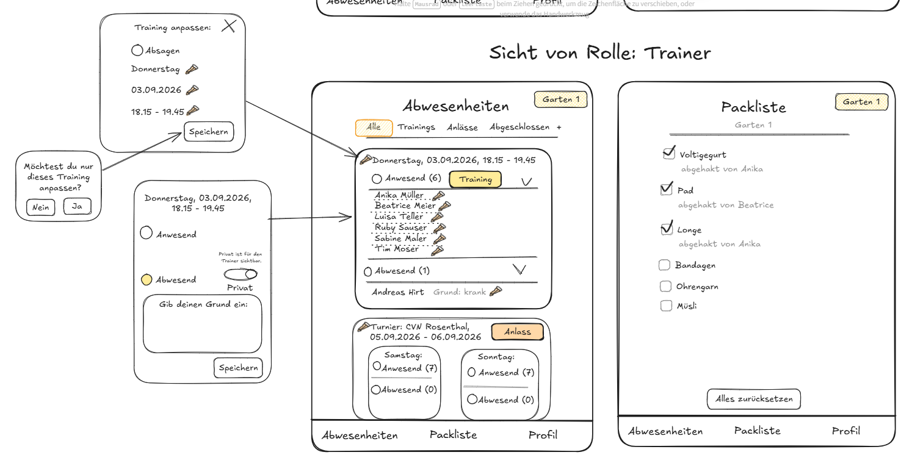
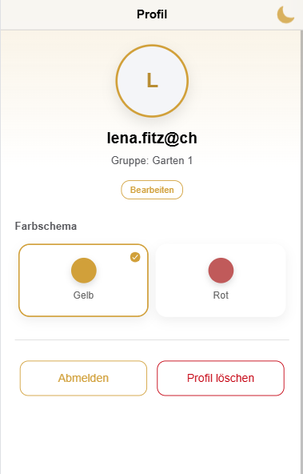

## 03.09., 8:00 - Grundidee für die Voltige Garten App skizziert.
- Anforderungen zum Projekt durchgegangen.

## 03.09., 9:00 - Mit dem Mockup begonnen
- Tabs Alle/Trainings/Anlässe/Abgeschlossen, Rollen Trainer/Volti/Eltern, Packliste als zusätzliches Feature ergänzt.
- Ionic-Projekt initialisiert.
- Offene Punkte mit Claude besprochen: Login-Konzept für Kinder ohne eigene E-Mail-Adresse oder Sichtbarkeit de Grundes. 
Nicht alle sollen den Grund sehen, deshalb gibt es die Einstellung privat oder öffentlich.

## 03.09., 11:00 - Grundstruktur im Projekt umgesetzt
- Tabs Alle / Abwesenheiten / Packliste / Profil.
- Eigenes Icon eingefügt.
- UI nach Mockup orientiert, sieht noch nicht gleich aus, Platzhalterdaten für Trainings/Anlässe ergänzt.

## 03.09., 13:00 - Beginn mit Login
- Formular für Anmeldung/Registrierung mit der passenden Validierung
- Entscheidung: Autorisierung über Einladungscode statt Freischaltung durch den Trainer oder E-Mail-Whitelist.
- Grund dafür ist, dass es ein minimaler Aufwand ist und so kein Admin nötig ist. 
Was daran nicht so optimal ist ist, dass der Code theoretisch weiter gegeben werden kann.
- Umgesetzt: separater Gruppen-Code und Trainer-Code, damit die Trainer-Rolle nicht über den allgemeinen Code erreichbar ist.

## 03.09., 14:00 - Profil-Screen hinzugefügt
- Profil-Screen hinzugefügt (Name, Gruppe, Abmelden, Profil löschen).

- Darkmode hinzugefügt
- Farbschema mit Gelb und Rot eingebaut.
- Allgemeines Design überarbeitet, da erste Version nicht überzeugend ist.
