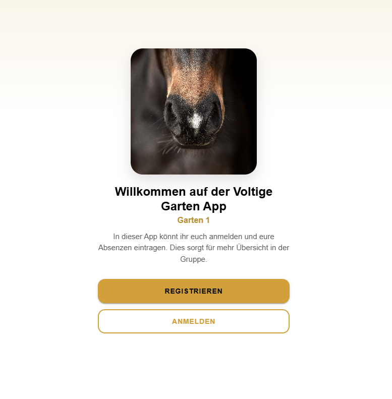

## 04.09., 8:00 - Start mit Backend

- Firebase und Supabase verglichen: Firebase bietet den schnelleren Start mit eingebautem Realtime-Sync, Supabase ist dagegen Open Source, selbst-hostbar und arbeitet mit Standard-SQL statt NoSQL.
- Entscheidung für Supabase, da das Projekt über die Abgabe hinaus weitergeführt wird.
- Supabase-Account erstellt, neues Projekt angelegt.
- Supabase CLI ins Projekt initialisiert und mit dem Projekt verknüpft.

## 04.09., 9:00 - Anbindung ans Backend

- Bisher lokal gehaltene Daten auf Supabase ausgelagert.
- Registrierte Nutzer:innen werden korrekt im Supabase unter Authentication angezeigt.
- Anmeldung/Registrierung verbessert: Prüfung, ob eine E-Mail bereits registriert ist, sowie angepasste Passwort-Mindestlänge.

## 04.09., 10:30 - Willkommensseite und Profil bearbeiten

- Willkommensseite für neue Nutzer:innen umgesetzt. Wurde die Seite bereits gesehen, geht es direkt zum Login.

- Bearbeiten im Profil funktionsfähig gemacht: Name ändern und Avatar-Upload zu Supabase Storage.

## 04.09., 11:00 - Absenzen-Logik und Termine

- Logik für Anwesend/Abwesend bei Trainings/Anlässen umgesetzt, mit dem Pflicht-Grundfeld bei Abwesenheit und Privat-Sichtbarkeit (Trainer sehen den Grund immer, alle anderen nur wenn es nicht privat ist).
- Trainer können über einen "+"-Button neue Trainings/Anlässe hinzufügen, inkl. Serientermine mit optionalem Verfalldatum.

## 04.09., 13:00 - Pipeline-Fix und Design der Abwesenheitsliste

- Fehler in der Pipeline behoben.
- Design der Abwesenheitsliste überarbeitet und ans Mockup angepasst.

## 04.09., 14:00 - Weiterer Input zur Pipeline

- Input zur Pipeline erhalten und eigener Runner erstellt.
- Pipeline gefixt.

## 04.09., 15.00 - DB-Fix
- Design für Abwesenheiten angepasst
- DB-Fix: Volti konnten sich nicht als abwesend eintragen – Ursache war ein falscher Unique Index, der einen "ON CONFLICT"-Fehler auslöste.
- DB-Fix: Der eigene Abwesenheitsgrund verschwand beim erneuten Öffnen bzw. war für einen selbst nicht sichtbar, da die View den eigenen Eintrag fälschlicherweise mitmaskiert hat.