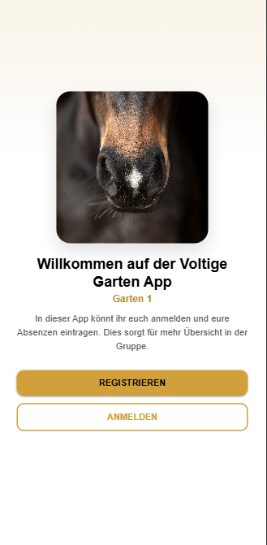
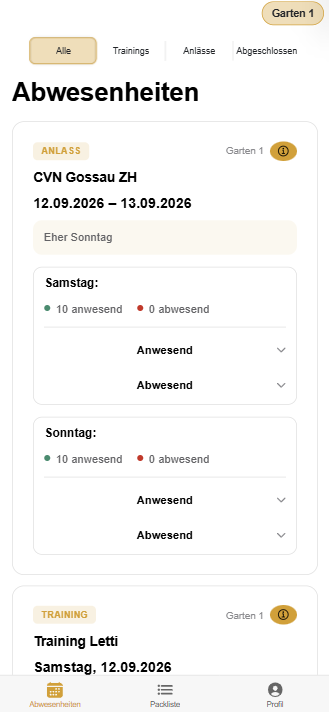
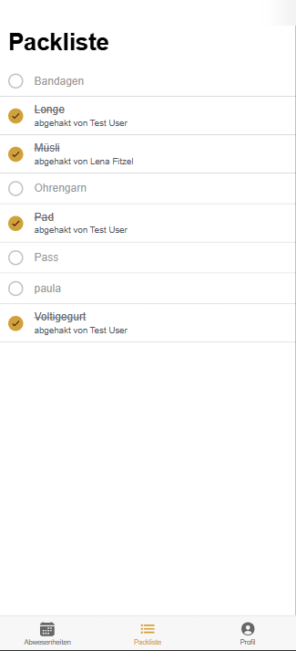
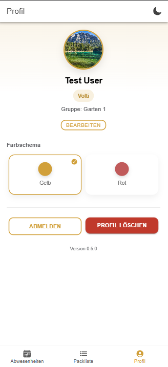

# Voltige Garten App

## Beschreibung

Die Voltige Garten App ist die zentrale Anlaufstelle für die Gruppe **Garten 1** –
für Voltigierer:innen, Eltern und Trainer:innen gleichermassen. Statt Abwesenheiten
über WhatsApp-Chats zu organisieren, läuft hier alles an einem Ort:
klar, übersichtlich und immer aktuell.

**Warum die App?**
Wer wann zum Training oder Anlass kommt, war bisher schwer zu überblicken – die App
schafft hier auf einen Blick Klarheit für die ganze Gruppe. Trainer:innen sehen sofort, wer anwesend oder abwesend ist, und können bei Bedarf direkt nachfragen. Voltis und Eltern wiederum sehen alle kommenden Trainings und Anlässe auf einen Blick, inklusive Zu- und Absagen der Gruppe.

### Das kann die App

**Absenzen im Griff**
- Trainings und Anlässe übersichtlich nach Kategorie filtern (Alle, Trainings,
  Anlässe, Abgeschlossen)
- Mit einem Tipp an- oder abmelden, inklusive optionalem Grund
- Absenzgründe können auf Wunsch privat gehalten werden – sichtbar nur für den
  Trainer
- Live-Übersicht, wer anwesend und wer abwesend ist, samt Namen und Gründen
- Mehrtägige Anlässe (z.B. Turniere oder Lager) werden tageweise dargestellt

**Für Trainer:innen**
- Neue Trainings und Anlässe erstellen, inklusive Bemerkungen für die ganze Gruppe
- Wiederkehrende, wöchentliche Trainings als Daueraufträge anlegen – wahlweise mit
  Verfalldatum
- Termine bei Bedarf absagen oder ganz löschen
- Volle Kontrolle über die Packliste der Gruppe

**Packliste**
- Gemeinsame Packliste für Turniere und Anlässe
- Jede Person hakt ab, was bereits eingepackt ist – inklusive Anzeige, wer was
  abgehakt hat
- Trainer:innen pflegen die Liste und können sie für den nächsten Anlass
  zurücksetzen

### Für wen ist die App?
Für alle Mitglieder von Garten 1 – Voltigierer:innen, ihre Eltern und die
Trainer:innen. Ein Einladungscode genügt für den Start; die passende Rolle wird
danach direkt zugewiesen.

## Screenshots

<table>
  <tr>
    <td align="center" width="25%">
       
      <b>Willkommens-Seite</b>
    </td>
    <td align="center" width="25%">
       
      <b>Abwesenheiten</b>
    </td>
    <td align="center" width="25%">
       
      <b>Packliste</b>
    </td>
    <td align="center" width="25%">
       
      <b>Profil</b>
    </td>
  </tr>
</table>
